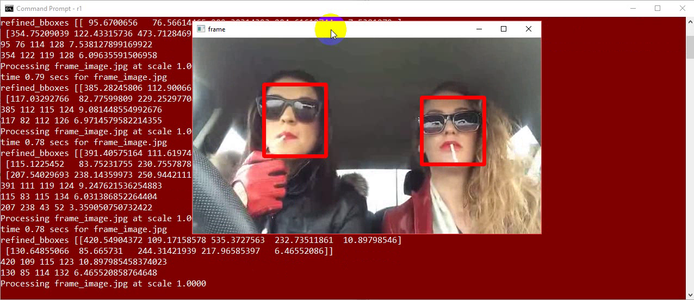
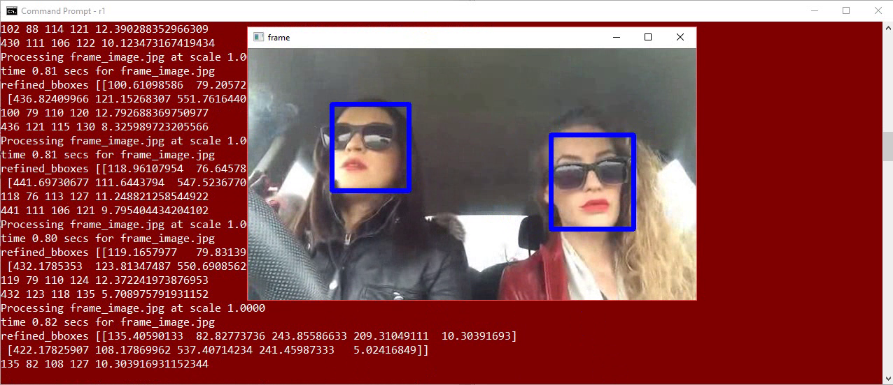

# smoking-faces
> Power Up Automation

## Overview

This is a command line tool that analyze videos and detects if a person is smoking.

## Demo video

[https://youtu.be/8t70o5xGK60](https://youtu.be/8t70o5xGK60)

## Setup

- Windows 10
- Python 3.6
- Python PIP (installed along with Python)

### Create and activate virtual env

Clone the repo to its own directory (e.g. `smoking-faces`) and inside the `smoking-faces` directory enter:

    python -m venv myenv && myenv\Scripts\activate

### Upgrade pip

You should consider upgrading Python Pip... 

    python -m pip install --upgrade pip

### Install Python requirements

    pip install -r requirements.txt

## Model files

Download from: [https://drive.google.com/open?id=1xk49IqOkQLLyMD3Uhj79E6d9sDJTjNRy](https://drive.google.com/open?id=1xk49IqOkQLLyMD3Uhj79E6d9sDJTjNRy)

These files are:

- `hr_res101` - Tiny_Faces_in_Tensorflow converted as per their instructions (see below)
- `smoking-faces-output-graph.pb` (smoking face detection tensorflow graph)
- `smoking-faces-output-graph.txt`

Once you've downloaded the files, please put them into `smoking-faces\detector\data\models` directory.

About `Tiny_Faces_in_Tensorflow`: A Tensorflow Tiny Face Detector, implementing "Finding Tiny Faces" https://github.com/cydonia999/Tiny_Faces_in_Tensorflow

## Running

Launch the tool using this syntax:

    python smokingdetection.py (video_filename.mp4) "screen" (video_fps)

E.g.

    python smokingdetection.py "data\videos\Smoking & Driving.mp4" "screen" 15

## Verification

### People smoking

### People is not smoking

